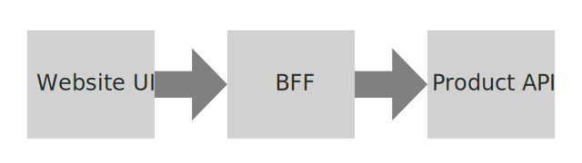

# Specmatic Sample Client Application

* [Specmatic Website](https://specmatic.io)
* [Specmatic Documentation](https://specmatic.io/documentation.html)



BFF = Backend For Frontend, the API invoked by the HTTP calls in the client HTML page (Website UI).

This project contains the product API, which is used by a small ecommerce client application.

Here is the [contract](https://github.com/znsio/specmatic-order-contracts/blob/main/io/specmatic/examples/store/openapi/api_order_v3.yaml) governing the interaction of the client with the product API.

The architecture diagram was created using the amazing free online SVG editor at [Vectr](https://vectr.com).

## Tech
1. .NET core
2. Specmatic
3. Docker

### Prerequisites

1. Dotnet SDK
2. If you are on a Windows OS, please use PowerShell.

### How to run the application?

1. Build the project using : `dotnet build`
2. Run the application using : `dotnet run`

### How to test the application?
1. Using `dotnet test`

## Running with Docker

### 1. Start Docker Desktop

Ensure Docker Desktop is running on your machine.

### 2. Run the Application using dotnet run

To run the **.NET** application in Docker, execute the following command:
```bash
docker run --network host -v "$PWD/specmatic.yaml:/usr/src/app/specmatic.yaml" \
-v "$PWD/build/reports/specmatic:/usr/src/app/build/reports/specmatic" \
znsio/specmatic test --port=8090 --host=host.docker.internal
